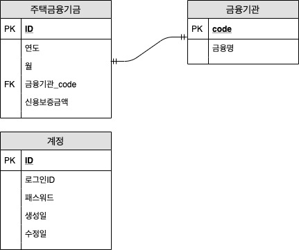
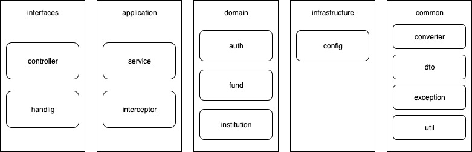

# 사전과제 3. 주택 금융 서비스 API 개발
 
## 개발 프레임워크 
* Java8
* Spring boot
* Spring data jpa
* H2
* lombok
* opencsv
* Java JWT
* apache commons-lang3
* maven

## 문제해결 전략
### DB 테이블


### 프로젝트 패키지 구조


### api별 문제해결 전략
#### 1. 데이터 파일에서 각 레코드를 데이터베이스에 저장하는 API 
  * multipart content-type 타입으로 csv 파일을 받는다.
  * opencsv를 이용하여 파싱하여 데이터를 추출 한다.
  * 첫라인(헤더)에서 기관(은행)정보를 추출하여 금융기관(institution) 테이블 저장 한다.
  * 두번째라인부터 마지막라인까지 추출 하여 연도, 월, 기관, 금액 정보를 주택금융기금(house_fund) 테이블 저장 한다.
  * 결과값으로 추가된 금융기관과 주택금융기금 개수를 결과로 내려 준다.

> /upload.html 접속하여 업로드 가능</br>
> [POST] /api/fund/csv

#### 2. 주택금융 공급 금융기관(은행) 목록을 출력하는 API 
  * 디비 금융기관(institution) 테이블 저장된 모든 데이터를 검색하여 내려 준다.

> [GET] /api/institution/list

#### 3. 년도별 각 금융기관의 지원금액 합계를 출력하는 API 
  * 디비 주택금융기금(house_fund) 테이블에서 년도와 기관별로 group by 하여 금액 합산 결과를 쿼리로 가져온다.
  * 년도별 총 금액과 각 금융기관의 금액 합계 결과를 내려 준다.

> [GET] /api/fund/totalYear

#### 4. 각 년도별 각 기관의 전체 지원금액 중에서 가장 큰 금액의 기관명을 출력하는 API
  * 디비 주택금융기금(house_fund) 테이블에서 년도와 기관별로 group by 하여 금액 합산 결과를 쿼리로 가져온다.
  * 합산된 금액 기준으로 sort 하여 제일 큰 금액을 찾아 결과를 내려 준다.

> [GET] /api/fund/maxBank

#### 5. 전체 년도에서 외환은행의 지원금액 평균 중에서 가장 작은 금액과 큰 금액을 출력하는 API
  * 디비 금융기관(institution)테이블에서 기관 정보를 가져온다.
  * 디비 주택금융기금(house_fund)테이블에서 해당 기관의 년도별 group by 하여 금액 평균값을 쿼리로 가져온다.
  * 디비에서 가져온 결과에서 가장 작은 값괄 큰 값을 찾아 결과를 내려 준다.

> [GET] /api/fund/average/외환은행

#### 6. 특정 은행의 특정 달에 대해서 2018년도 해당 달에 금융지원 금액을 예측하는 API(완료못함)
  * 디비 금융기관(institution)테이블에서 기관 정보를 가져온다.
  * 디비 주택금융기금(house_fund)테이블에서 해당 기관의 모든 정보를 가져온다.

> [GET] /api/fund/estimate/{bankName}/{month}

#### 7. 계정생성 API
  * id와 패스워드를 받아 패스워드는 sha256으로 인코딩 한다.
  * 계정 정보를 디비에 저장 한다.
  * 계정 정보로 jwt를 만든다. 
  * jwt는 jjwt를 사용하여 만듬(https://github.com/jwtk/jjwt)
  * id와 생성된 토큰정보를 내려 준다.

> [POST] /api/account/signup

#### 8. 로그인 API
  * id와 패스워드를 받아 id로 디비에서 계정정보를 검색한다.
  * 검색된 계정정보에서 패스워드 검증을 한다.
  * 검증이 성공하면 토큰을 생성하연 내려 준다.

> [POST] /api/account/signin

#### 9. 토큰 검증 및 재발급
  * 검증과 재발급 처리는 spring interceptor를 사용하여 처리 한다.
  * 모든 http Authorization 헤더에 토큰이 있는지 체크 한다.
  * 토큰이 있다면 검증 한다. 검증에 성공하면 api에 접근 할수 있다.
  * 토큰이 없거나 검증 실패 하면 api에 접근 할수 없다.
  * Authorization 헤더에 "Bearer_Token" 값이 들어 있다면 기존 토큰을 검증하고 토큰을 재발행 한다.


## 빌드 및 실행 방법
  - java8 이상 필요

  * 소스를 내려 받는다.
  ```bash
  $ git clone https://github.com/Hyunzzang/houseFinancialService.git
  ```

  * 프로젝트 디렉토리의 mvnw으로 빌드 (mac os)
  ```bash
  $ cd houseFinancialService
  $ ./mvnw clean package
  ```
  * mvnw으로 빌드 (윈도우)
  ```bash
  ./mvnw.cmd clean install
  ```

  * 빌드 후 java -jar 으로 실행 방법 
  ```bash
  $ java -jar target/house-0.0.1-SNAPSHOT.jar
  ```
  * mvnw으로 spring boot 실행 방법
  ```bash
  $ ./mvnw spring-boot:run
  ```
 

## API 실행 시나리오
#### 1. 계정 등록
- 아이디와 패스워드로 보내 계정을 만든다.
- {로그인 아이디}, {로그인 패스워드}만 수정하면 됨

> curl -X POST http://localhost:8080/api/account/signup -H 'cache-control: no-cache' -H 'content-type: application/json' -d '{ "authId":{로그인 아이디}, "pw":{로그인 패스워드} }'

#### 2. 로그인 
- 등록한 아이와 패스워드로 로그인 한다.
- 결과로 토큰을 받을 수 있다. 아래 api에 접근 하기 위해서 필요하다.
- {로그인 아이디}, {로그인 패스워드}만 수정하면 됨

> curl -X POST http://localhost:8080/api/account/signin -H 'cache-control: no-cache' -H 'content-type: application/json' -d '{ "authId":{로그인 아이디}, "pw":{로그인 패스워드} }'

#### 3. 주택금융 공급현황 분석 데이터 디비에 저장
- 웹브라우저에서 /upload.html에 접속하여 csv 파일을 추가 한다.
- 토큰 인증에서 제외

> http://localhost:8080/uplad.html  

#### 4. 금융기관(은행) 목록을 출력
- 로그인 후 결과로 받은 토큰 값을 {로그인 후 받은 토큰}에 입력하면 됨

> curl -X GET http://localhost:8080/api/institution/list -H 'authorization: {로그인 후 받은 토큰}' -H 'cache-control: no-cache' -H 'content-type: application/json'


#### 5. 년도별 각 금융기관의 지원금액 합계를 출력
- 로그인 후 결과로 받은 토큰 값을 {로그인 후 받은 토큰}에 입력하면 됨

> curl -X GET http://localhost:8080/api/fund/totalYear -H 'authorization: {로그인 후 받은 토큰}' -H 'cache-control: no-cache' -H 'content-type: application/json'

#### 5. 각 년도별 각기관의 전체지 원금액 중에서 가장 큰 금액의 기관명을 출력
- 로그인 후 결과로 받은 토큰 값을 {로그인 후 받은 토큰}에 입력하면 됨

> curl -X GET \
  http://localhost:8080/api/fund/maxBank \
  -H 'authorization: {로그인 후 받은 토큰}' \
  -H 'cache-control: no-cache' \
  -H 'content-type: application/json'

#### 6. 전체 년도에서 외환은행의 지원금액 평균 중에서 가장 작은 금액과 큰 금액을 출력
- 로그인 후 결과로 받은 토큰 값을 {로그인 후 받은 토큰}에 입력하면 됨
- /api/fund/average/{은행명} 은행명이 한글일 경우 url encode를 해야함
  
> curl -X GET \
  http://localhost:8080/api/fund/average/%EC%99%B8%ED%99%98%EC%9D%80%ED%96%89 \
  -H 'authorization: {로그인 후 받은 토큰}' \
  -H 'cache-control: no-cache' \
  -H 'content-type: application/json'

#### 7. 토큰 재발급
- 로그인 후 결과로 받은 토큰 값을 {로그인 후 받은 토큰}에 입력하면 됨
- 
>curl -X GET \
  http://localhost:8080/api/institution/list \
  -H 'authorization: Bearer {로그인 후 받은 토큰}' \
  -H 'cache-control: no-cache' \
  -H 'content-type: application/json'